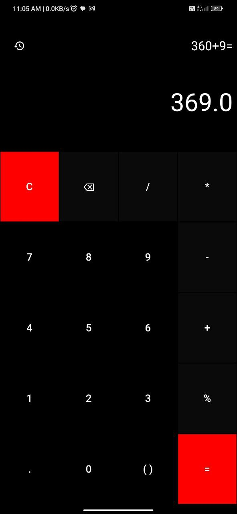
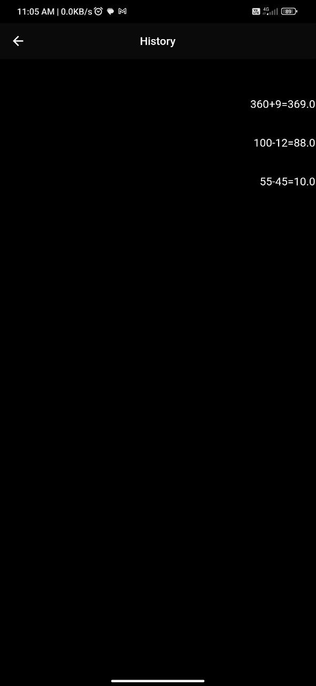

# calculator

A new Flutter project.

## Getting Started

This is a simple calculator application developed using the Flutter framework. The app provides basic arithmetic calculations and a user-friendly interface.

## Features

- Addition, subtraction, multiplication, division and reminder operations
- Clear button to reset the current calculation
- Responsive design for various screen sizes

## ScreenShots

# Flutter Basic Calculator App

This is a simple calculator application developed using the Flutter framework. The app provides basic arithmetic calculations and a user-friendly interface.

